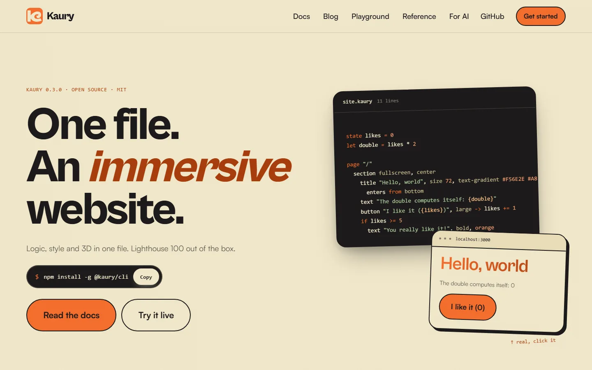
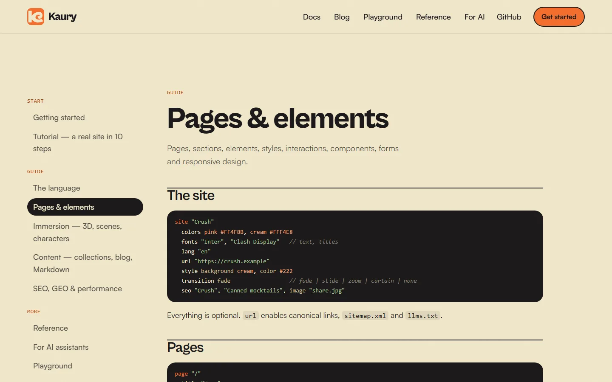

<p align="center">
  
</p>

<h1 align="center">Kaury</h1>

<p align="center">
  <strong>The programming language for immersive websites.</strong><br>
  One file holds the logic, the structure, the style and the 3D of a site.<br>
  The compiler turns it into server-rendered HTML that scores 100 on Lighthouse.
</p>

<p align="center">
  <a href="https://www.npmjs.com/package/@kaury/cli"></a>
  <a href="LICENSE"></a>
  
  
</p>

<p align="center">
  <a href="site/content/docs/getting-started.md">Getting started</a> ·
  <a href="site/content/docs/tutorial.md">Tutorial</a> ·
  <a href="site/content/blog">Tutorials</a> ·
  <a href="docs/kaury-ai.md">Spec for AI assistants</a> ·
  <a href="site/site.kaury">A real site in Kaury</a>
</p>

<br>

<p align="center">
  
</p>

## One file, a whole site

```kaury
site "Bloom"
  colors pink #E93D82, cream #FFF6EE
  fonts "Satoshi", "Cabinet Grotesk"
  style background cream

state likes = 0

style card-soft
  background white, radius 20, padding 24
  hover lift 6, shadow medium

page "/"
  seo "Bloom", "Flowers that speak"
  scene fullscreen, particles dust
    light soft
    object "knot", color pink, metal
      spin on scroll
      follows mouse, smooth
    title "Flowers that *speak*.", size 80
  section
    column card-soft
      text "Delivered the same day in Vevey."
      button "I like it ({likes})" -> likes += 1
```

That is the whole site: no HTML, no CSS, no JavaScript, no config file. `kaury build` makes a static site with server-rendered pages, inlined CSS, responsive images, self-hosted fonts, a sitemap, `llms.txt` and structured data.

## Start in 30 seconds

```bash
npm install -g @kaury/cli
kaury new my-site
cd my-site
kaury dev
```

Open `http://localhost:3000`, edit `site.kaury`, save: the page reloads by itself.

## Why Kaury

| | A usual stack | Kaury |
|---|---|---|
| Files for a landing page | components, CSS, config, router… | **one `.kaury` file** |
| Styles | CSS or a CSS framework | **words**: `style card`, `hover lift 4`, `mobile padding 12` |
| Animations | keyframes, a motion library | `animation slide, 30s, loop` · `enters from bottom` |
| 3D | Three.js code | `object "knot", metal` · `scene`, `light`, `camera` |
| Performance | to tune by hand | **100 on Lighthouse by default** |
| SEO and AI visibility | plugins | sitemap, Open Graph, JSON-LD, `llms.txt` built in |
| Errors | a stack trace | the line, the word and the fix: `did you mean "count"?` |

## What is inside

- **Reactive by default** — `state` changes, the page follows; `let total = price * quantity` recomputes itself.
- **A design system without CSS** — named styles with states (`hover`, `selected`, `open`…), parts (`link`, `title`…) and screens (`mobile`, `tablet`); a style named after an element restyles all of them.
- **Motion** — your own animations with `from` / `to`, entrances on scroll, reduced motion respected.
- **3D as a word** — `.glb` models or built-in shapes (`sphere`, `knot`, `gem`, `torus`…), lights, cameras, particles, characters. Three.js loads only on pages with 3D, after the first paint.
- **Ready-made blocks** — `Hero`, `Features`, `Pricing`, `Testimonials`, `Faq`, `Contact`, `Footer`… in your colors, nothing to import; write your own component of the same name to replace one.
- **Forms that send e-mails** — `form mail "hello@you.com"`: shown in the terminal while you build, sent through [Resend](https://resend.com) once online, with the endpoint written for Netlify, Vercel, Cloudflare Pages and any PHP host (FTP).
- **Content** — Markdown, MDX and YAML collections read at build time, one page per post, code blocks colored at build time.
- **Fast by construction** — server rendering and hydration, zero JavaScript on pages without interaction, only the CSS a page needs, frames loaded near the screen.
- **Accessible** — text colors chosen for WCAG contrast, real HTML in front of the 3D, tabs with the right roles.
- **Open to the rest** — import any npm package, or drop a `js` block when you need one.

<p align="center">
  
  <br><sub>The site of the language is <a href="site/site.kaury">one Kaury file</a> with no CSS file: 18 pages, a blog, a 3D scene.</sub>
</p>

## Made for AI assistants

Kaury is short, regular and checked by a compiler that explains its errors — what a language model needs to write code that works the first time.

- [`docs/kaury-ai.md`](docs/kaury-ai.md) is the whole language in one file: give it to Claude, ChatGPT, Gemini or Cursor and ask for a site.
- `kaury new` puts an `AGENTS.md` and the spec in every project, so an assistant opened in it knows what to do.
- `kaury check --json` returns each problem with its line, column and fix: an agent can correct itself in a loop.
- The built sites publish `llms.txt`, and the language's site an [ARD](https://agenticresourcediscovery.org/spec/) `ai-catalog.json`.

## Commands

| Command | What it does |
|---|---|
| `kaury new my-site` | creates a ready-to-use project (`--template landing`, `blog`, `portfolio`) |
| `kaury dev` | live preview, reloads on every change |
| `kaury check [--json]` | checks the code without building |
| `kaury build` | the final, optimized site in `dist/` |
| `kaury deploy --netlify` | builds then publishes (`--vercel` too) |
| `kaury run file.kaury` | runs a program without pages |
| `kaury compile file.kaury` | shows the generated JavaScript |

Messages are in English; French keywords and messages exist too (`--lang fr`).

## Documentation

| Start | Guide | Learn by building |
|---|---|---|
| [Getting started](site/content/docs/getting-started.md) | [The language](site/content/docs/language.md) | [A landing page in 30 lines](site/content/blog/landing-page-in-30-lines.md) |
| [Tutorial: a site in 10 steps](site/content/docs/tutorial.md) | [Pages, elements, styles](site/content/docs/web.md) | [Your first 3D scene](site/content/blog/first-3d-scene.md) |
| [Spec for AI assistants](docs/kaury-ai.md) | [Immersion: 3D](site/content/docs/immersion.md) | [A design system without CSS](site/content/blog/design-system-without-css.md) |
| | [Blocks, forms, templates](site/content/docs/blocks.md) | |
| | [Content and blog](site/content/docs/content.md) | [Let an AI write your site](site/content/blog/ai-writes-kaury.md) |
| | [SEO, GEO, performance](site/content/docs/seo-geo.md) | |

Every Kaury example of these pages is compiled by the test suite: the docs cannot drift from the language.

## Status

Kaury is young (0.4). It already builds complete multi-page sites with 3D, ready-made blocks, forms that send e-mails and four templates, and its own site is written in it. On the way: a language server for every editor and the published VS Code extension (its source is in [`editors/vscode`](editors/vscode)).

Ideas, bugs, questions: [open an issue](https://github.com/theoblondel/kaury-lang/issues).

## How it works

```
.kaury → lexer → parser → checker → code generator → HTML + CSS + JS
                                     immersion (Three.js, Lottie), loaded on demand
```

| Folder | Content |
|---|---|
| `src/core/` | lexer, parser, checker, code generator, syntax highlighting (also runs in the browser) |
| `src/runtime/` | reactivity, DOM and hydration, router, motions, server rendering, Markdown |
| `src/immersion/` | 3D (Three.js), shapes, Lottie, particles |
| `src/cli/` | the `kaury` command, build, images, fonts, content collections |
| `site/` | the site of the language, written in Kaury |
| `examples/` | Crush (complete immersive site), hello |
| `docs/` | the specification for AI assistants |
| `editors/vscode/` | VS Code extension |
| `playground/` | the in-browser playground |

## Developing Kaury

```bash
npm install
npm test                                  # language, errors, build, hydration, docs examples
npm run kaury -- dev examples/crush/site.kaury
npm run build                             # the command, the compiler, the playground, the VS Code copy
npm run site                              # builds the site of the language in site/dist
node scripts/measure.mjs site/dist /      # Lighthouse (mobile; add --desktop)
```

## License

MIT — made in Switzerland by [Kaury Studio](https://kaury.studio).
